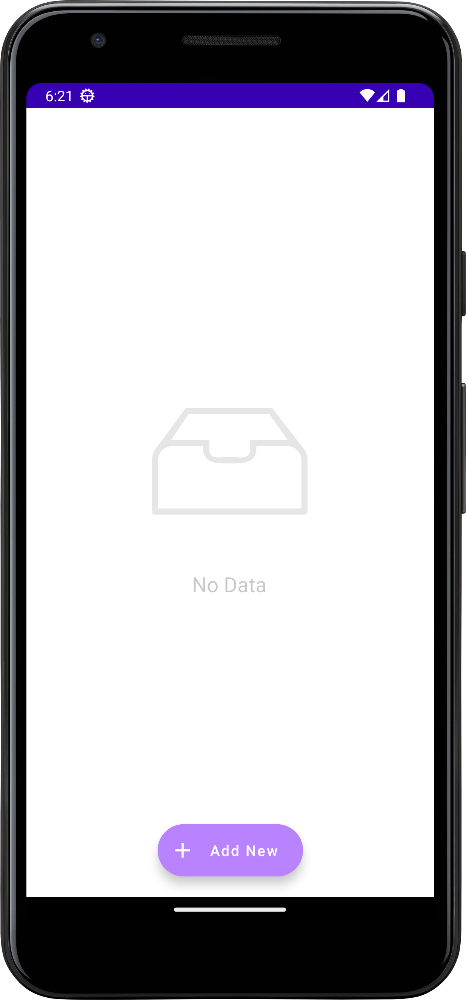

# Expense-Tracker-Acountify
Basically it is an Android Application for tracking of expenses.

# Technologies
1. 
2. 
3. 
4. 

# Operations that we can perform
1. Add expenses.
2. Read expenses.
3. Update expenses.
4. Delete expenses.

# Snaps

# Contributing

Contributions are what make the open source community such an amazing place to learn, inspire, and create. Any contributions you make are greatly appreciated.

If you have a suggestion that would make this better, please fork the repo and create a pull request. You can also simply open an issue with the tag "enhancement". Don't forget to give the project a star! Thanks again!

1. Fork the Project
2. Create your Feature Branch (git checkout -b feature/2. AmazingFeature)
3. Commit your Changes (git commit -m 'Add some AmazingFeature')
4. Push to the Branch (git push origin feature/AmazingFeature)
5. Open a Pull Request
